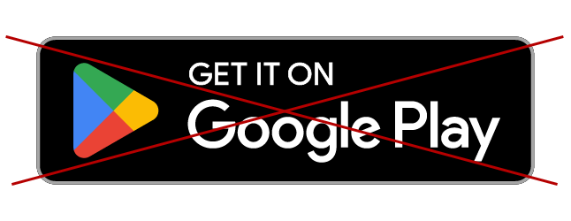
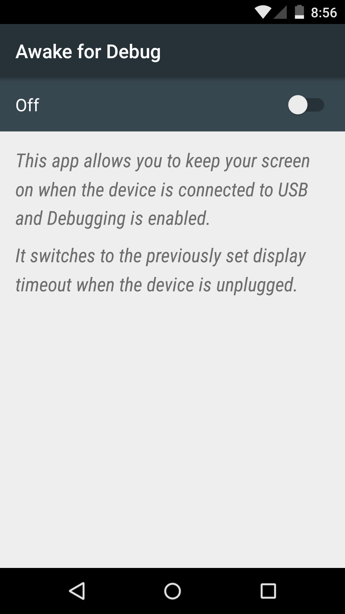
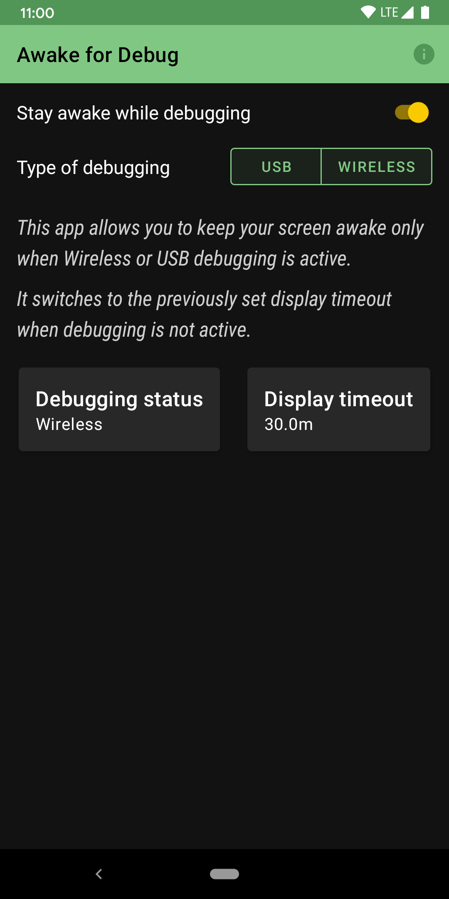

Awake for Debug [](https://github.com/AfzalivE/AwakeDebug/actions?query=workflow%3A%22Deploy+CI%22) [](https://github.com/AfzalivE/AwakeDebug/actions?query=workflow%3A%22Develop+builds%22)
==========

I've decided to remove this app from Google Play for privacy reasons. Please build the app yourself :)



<p align="left">
  
  
</p>


Awake for Debug allows you to keep your screen awake while Wireless or USB debugging is active.

It switches to the previously set display timeout when the device is unplugged.

Permissions:
- Notification access to monitor active debugging notifications
- WRITE_SETTINGS to set the display timeout
- INTERNET for Crashlytics (crash reports)

Note: If the app crashes, please send the crash report so that I can fix it. No user-specific information is sent, only information related to the crash (stacktrace) and device information like OS version, free space, rooted/non-rooted, free RAM, etc, is sent.

## Building from source

To build the Awake for Debug application from source, follow these steps:

1.  **Clone the repository:**
    ```bash
    git clone https://github.com/AfzalivE/AwakeDebug.git
    ```
2.  **Navigate to the project directory:**
    ```bash
    cd AwakeDebug
    ```
3.  **Build the application using Gradle:**
    *   For a debug build:
        ```bash
        ./gradlew assembleDebug
        ```
    *   For a release build (you will need to set up signing configurations):
        ```bash
        ./gradlew assembleRelease
        ```
    The compiled APK files will be located in the `app/build/outputs/apk/` directory.

### Contributors

Thank you for your contributions!

- @dmytroKarataiev
- @drmercer

### Contributing
All contributions are welcome!


### License

```
Copyright 2020 Afzal Najam.

Licensed under the Apache License, Version 2.0 (the "License");
you may not use this file except in compliance with the License.
You may obtain a copy of the License at

   http://www.apache.org/licenses/LICENSE-2.0

Unless required by applicable law or agreed to in writing, software
distributed under the License is distributed on an "AS IS" BASIS,
WITHOUT WARRANTIES OR CONDITIONS OF ANY KIND, either express or implied.
See the License for the specific language governing permissions and
limitations under the License.
```


> Note: Google Play and the Google Play logo are trademarks of Google LLC.
